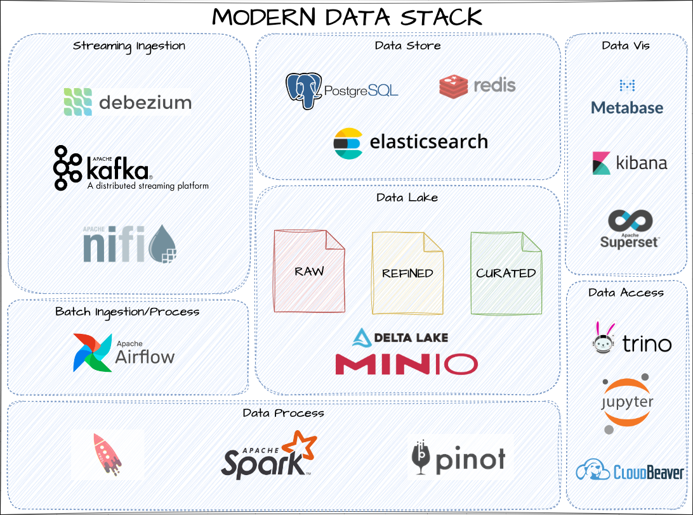

# BIG DATA ECOSYSTEM - MODERN DATA STACK COM DOCKER

Ambiente para estudo dos principais framework de um ambiente moderno de dados utilizando docker.
 

## SOFTWARES NECESSÁRIOS
#### Para a criação e uso do ambiente vamos utilizar o git e o Docker 
   * Instalação do Docker Desktop no Windows [Docker Desktop](https://hub.docker.com/editions/community/docker-ce-desktop-windows) ou o docker no [Linux](https://docs.docker.com/install/linux/docker-ce/ubuntu/)
   *  [Instalação do git](https://git-scm.com/book/pt-br/v2/Come%C3%A7ando-Instalando-o-Git)
   
## SETUP
   * OBS: A primeira vez que o ambiente for iniciado, todas as imagens serão baixadas para a maquina local. 
   * Para executar todo o ambiente, o servidor/host deve possuir pelo menos 16GB de memória.
   * É indicado subir apenas os containers para o worload que será utilizado/testado.

INICIANDO O AMBIENTE*

#### Em um terminal/DOS/PowerShell, realizar o clone do projeto no github.
          git clone https://github.com/fabiogjardim/mds.git

#### Ao realizar o clone do repositório, o diretória mds será criado em sua máquina local.

   
## EXEMPLOS DE COMO INICIR O AMBIENTE

  *No Windows abrir PowerShell, do Linux um terminal e acessar o diretório mds*
  
### Para iniciar um ambiente com Data Lake e Spark

          docker-compose up -d minio spark-worker        

### Para iniciar um ambiente com Ingestão de dados com CDC no Postgres utilizando Kafka
 
         docker-compose up -d minio kafka-broker kafka-connect nifi postgres

## SOLUCIONANDO PROBLEMAS 

### Parar verificar os containers em execução
         docker ps 

### Parar um containers
         docker stop [nome do container]      

### Parar todos containers
         docker stop $(docker ps -a -q)
  
### Remover um container
         docker rm [nome do container]

### Remover todos containers
         docker rm $(docker ps -a -q)         

### Dados do containers
         docker container inspect [nome do container]

### Iniciar um container específico
         docker-compose up -d [nome do container]

### Iniciar todos os containers (CUIDADO, é muito pesado)
         docker-compose up -d 

### Acessar log do container
         docker container logs [nome do container] 

## Acesso WebUI dos Frameworks
 
* Minio *http://localhost:9051*
* Jupyter Spark *http://localhost:8889*
* Pinot *http://localhost:9000*
* Nifi *http://localhost:9090*
* Kafka Control Center *http://localhost:9021*
* Airflow *http://localhost:8180*
* Elastic *http://localhost:9200*
* Metabase *http://localhost:3000*
* Kibana *http://localhost:5601*
* Superset *http://localhost:8088*
* Trino *http://localhost:8080*
* CloudBeaver *http://localhost:8010*

## Usuários e senhas

   ##### Superset
    Usuário: admin
    Senha: admin

   ##### Metabase
    Usuário: admin@mds.com
    Senha: admin 

   ##### Postgres
    Usuário: admin
    Senha: admin
   
   ##### Minio
    Usuário: admin
    Senha: admin
       
   ##### Pinot
    Usuário: admin
    Senha: admin
        
   ##### Kibana
    Usuário: admin
    Senha: admin
        
   ##### CloudBeaver
    Usuário: admin
    Senha: admin
   

## Imagens   

[Docker Hub](https://hub.docker.com/u/fjardim)

## Documentação oficial dos ambientes em container

* [Cloudbeave](https://dbeaver.com/docs/cloudbeaver/Run-Docker-Container/)
* [Trino](https://trino.io/docs/current/installation/containers.html)
* [Superset](https://superset.apache.org/docs/installation/installing-superset-using-docker-compose/)
* [Metabase](https://www.metabase.com/docs/latest/installation-and-operation/running-metabase-on-docker)
* [DeltaLake](https://delta.io/)
* [Minio](https://min.io/docs/minio/container/operations/installation.html)
* [Elastic](https://www.elastic.co/guide/en/elasticsearch/reference/current/docker.html)
* [Postgres](https://github.com/docker-library/postgres)
* [Pinot](https://docs.pinot.apache.org/basics/getting-started/running-pinot-in-docker)
* [Jupyter Spark](https://jupyter-docker-stacks.readthedocs.io/en/latest/using/specifics.html)
* [Airflow](https://airflow.apache.org/docs/apache-airflow/stable/howto/docker-compose/index.html)
* [Kafka Confluent](https://docs.confluent.io/platform/current/installation/docker/installation.html)
* [Debezium](https://debezium.io/documentation/reference/stable/docker.html)
* [Nifi](https://hub.docker.com/r/apache/nifi)
